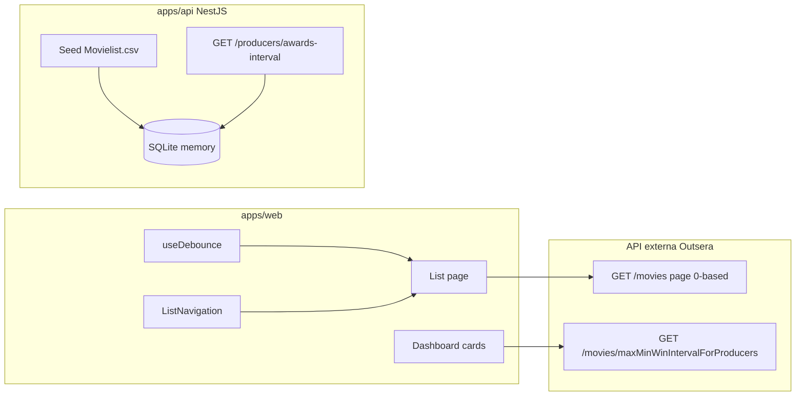

# Plano: correções da avaliação + OpenSpec/Storybook/docs

> Local: [`docs/plans/correcoes-avaliacao-ia.md`](correcoes-avaliacao-ia.md)  
> Origem: plano gerado no Cursor em 2026-10-03.

## Contexto da arquitetura



- Front consome `https://challenge.outsera.tech/api/` ([`apps/web/src/shared/api/api.ts`](apps/web/src/shared/api/api.ts)).
- Back local é NestJS + SQLite em memória, seed de [`apps/api/src/database/Movielist.csv`](apps/api/src/database/Movielist.csv), endpoint `GET /producers/awards-interval`.
- O PDF de avaliação cobre sobretudo o back-end (CSV, contrato, e2e, DB em memória, README, registro de IA). Os itens 1–4 são bugs reais do front.

**Decisões fixadas neste plano**

- Paginação alinhada ao Spring **0-based** (não converter para 1-based no UI).
- Storybook: shared UI + componentes-chave (intervalo, filtros, paginação).
- OpenSpec na raiz do monorepo, com uma change cobrindo este pacote de correções.
- Documento de IA em português, em `docs/`, no padrão dos READMEs existentes.

---

## 1. Card Maximum/Minimum (front)

**Causa raiz** em [`shortest-longest-interval.tsx`](apps/web/src/modules/dashboard/components/shortest-longest-interval/shortest-longest-interval.tsx):

```ts
const min = response.data?.data.min || [];
const max = response.data?.data.min || []; // bug: deveria ser .max
```

Além disso, a seção “Maximum” renderiza `min` e “Minimum” renderiza `max`.

**Correção**

- Bind correto: `max` ← `.max`, `min` ← `.min`.
- Maximum renderiza `max`; Minimum renderiza `min`.

**Testes** em [`shortest-longest-interval.test.tsx`](apps/web/src/modules/dashboard/components/shortest-longest-interval/shortest-longest-interval.test.tsx): mocks distintos para `min` e `max`; assertivas por seção (Maximum/Minimum) garantindo produtores/intervalos diferentes.

---

## 2. Debounce do filtro de ano

**Causa raiz** em [`useDebounce.ts`](apps/web/src/shared/hooks/useDebounce.ts): zera o ref **antes** do `clearTimeout`, então o timer anterior nunca é cancelado — vários callbacks disparam e o último valor pode ser sobrescrito.

**Correção**

```ts
if (debounceRef.current) clearTimeout(debounceRef.current);
debounceRef.current = setTimeout(callback, timeout);
```

- cleanup no unmount (`useEffect` return).

**Testes** novos em `apps/web/src/shared/hooks/useDebounce.test.ts` (fake timers): digitação rápida → 1 chamada com último valor; alterações consecutivas; limpeza cancela pendente.

Ajustar [`list-filters.test.tsx`](apps/web/src/modules/movie-list/components/list-filters/list-filters.test.tsx) para validar debounce no filtro de ano (navigate só após o delay).

---

## 3 e 4. Primeira página + paginação

Bugs encadeados (API Outsera é 0-based):

| Arquivo                                                                                                 | Problema                                                                                                     |
| ------------------------------------------------------------------------------------------------------- | ------------------------------------------------------------------------------------------------------------ |
| [`list.tsx`](apps/web/src/routes/list.tsx)                                                              | default `page: 1` pula a página 0; `validateSearch` descarta `year`/`winner`                                 |
| [`list-navigation.tsx`](apps/web/src/modules/movie-list/components/list-navigation/list-navigation.tsx) | `pageNumber \|\| 1` trata `0` como falsy; Previous desabilitado em `=== 1`; fórmula “Showing” assume 1-based |
| [`list-filters.tsx`](apps/web/src/modules/movie-list/components/list-filters/list-filters.tsx)          | reset de filtro para `page: 1`                                                                               |
| [`use-movies.ts`](apps/web/src/modules/movie-list/api/use-movies.ts)                                    | `queryKey: ['movies']` sem params → cache/concorrência inconsistente                                         |

**Correção**

- Default `page: 0`, `size: 10`; validar e preservar `year`/`winner` no search.
- `currentPage = pageNumber ?? 0`; Previous `disabled` quando `currentPage === 0`.
- `from = size * page + 1`, `to = min(size * (page + 1), total)`.
- Filtros resetam para `page: 0`.
- `queryKey: ['movies', params]`; remover `useEffect`+`refetch` manual se o key já reativa a query.

**Testes**

- Página 0: Previous disabled, “Showing 1 to N…”, Next habilitado.
- Avançar/voltar atualiza `page` no navigate.
- Última página: Next disabled.
- Filtro de ano reseta para `page: 0` e mantém filtro no search.

---

## 5. RFN 2 — e2e com arquivo padrão (back)

Hoje [`awards-interval.e2e-spec.ts`](apps/api/test/producer/awards-interval.e2e-spec.ts) só checa tipos/estrutura.

**Correção**

1. Garantir seed confiável: `await` em `parseFile` em [`seed.service.ts`](apps/api/src/database/seed.service.ts) (hoje o bootstrap pode terminar antes do CSV carregar).
2. No bloco “dados padrões”, assertar o **resultado golden completo** de `GET /producers/awards-interval` derivado de `Movielist.csv` (conteúdo de `min`/`max`: producer, interval, previousWin, followingWin, quantidade e ordenação observável). Valores exatos serão confirmados na implementação rodando a API/e2e uma vez contra o CSV oficial (referência conhecida do desafio: Joel Silver interval 1; Matthew Vaughn interval 13 — validar antes de hardcodar).
3. Manter testes com CSV mockado para cenários (empates, 3+ vitórias, parsing `and`/vírgula).

Isso faz o e2e falhar se o CSV oficial mudar de forma que altere o resultado da API.

---

## 6. Reduzir loops no cálculo (back)

Em [`producer.service.ts`](apps/api/src/modules/producers/producer.service.ts) há ~4 passagens lineares extras após montar os intervalos (`map`+`Math.min`, `map`+`Math.max`, 2× `filter`).

**Correção**: após gerar os intervalos consecutivos (1 passagem necessária por produtor), um único loop acumula min/max e as listas associadas. Sem mudar o contrato nem a legibilidade.

Explicar no resumo final quais loops foram combinados.

---

## 7. Documento de interações com IA (PDF §5)

Criar [`docs/AI_INTERACTIONS.md`](docs/AI_INTERACTIONS.md) (não existe `docs/` hoje; READMEs ficam na raiz/apps — pasta `docs/` concentra artefatos de auditoria).

Registrar, em português:

- ferramenta/modelo (Cursor / Composer / OpenSpec);
- data/contexto;
- prompts e objetivos;
- orientações relevantes;
- alterações de código decorrentes;
- validação humana / ajustes posteriores;
- comandos OpenSpec usados (`openspec init`, `/opsx:propose`, `/opsx:apply`, etc.).

Atualizar links nos READMEs.

---

## 8. OpenSpec ([Fission-AI/openspec](https://github.com/Fission-AI/openspec))

1. Instalar CLI e rodar `openspec init` na raiz (Cursor).
2. Criar change (ex.: `fix-evaluation-issues`) com `proposal.md`, `design.md`, `tasks.md` e deltas em `openspec/changes/.../specs/` cobrindo:
   - producers awards-interval + e2e CSV padrão;
   - dashboard max/min binding;
   - debounce;
   - paginação 0-based + filtros no search.
3. Implementar seguindo `/opsx:apply` / tasks do OpenSpec.
4. Referenciar o fluxo no doc de IA e no README raiz.

---

## 9. Storybook + documentação

Storybook já parcialmente em [`.storybook/main.ts`](apps/web/.storybook/main.ts) (auto-story + `docsMode: true`, sem stories manuais).

**Melhorias**

- Desligar `docsMode: true` para navegar stories + docs.
- Stories manuais para Button, Input, Select, TableList, ShortestLongestInterval, ListFilters, ListNavigation (autodocs).
- MDX intro (`Introduction.mdx`) com fluxo do app e como rodar.
- README web/raiz: `pnpm --filter web storybook`, contrato da API, como rodar e2e, checklist do PDF (CSV no boot, endpoint, SQLite memory, só testes de integração no back, registro de IA).

Checklist PDF a cobrir na doc/validação:

1. Leitura CSV + insert no boot
2. `GET` intervalo min/max no formato da página 2
3. Richardson level 2
4. Testes de integração alinhados ao arquivo padrão
5. DB embarcado em memória
6. README com run + testes
7. Repo git + registro de interações com IA

---

## 10. Validação final

```bash
pnpm test        # front
pnpm test:e2e    # api
pnpm --filter web storybook  # smoke manual se ambiente permitir
```

Casos críticos: max ≠ min no card; debounce com timers; página 0 e navegação; e2e golden do CSV; loops reduzidos; `docs/AI_INTERACTIONS.md` + `openspec/` presentes.

---

## Arquivos principais a tocar

**Front:** `shortest-longest-interval.tsx` (+ test), `useDebounce.ts` (+ test), `list.tsx`, `list-navigation.tsx` (+ test), `list-filters.tsx` (+ test), `use-movies.ts`, `.storybook/*`, novas `*.stories.tsx` / MDX

**Back:** `producer.service.ts`, `seed.service.ts`, `awards-interval.e2e-spec.ts`

**Docs/processo:** `docs/AI_INTERACTIONS.md`, `README.md`, `apps/api/README.md`, `apps/web/README.md`, `openspec/**`
